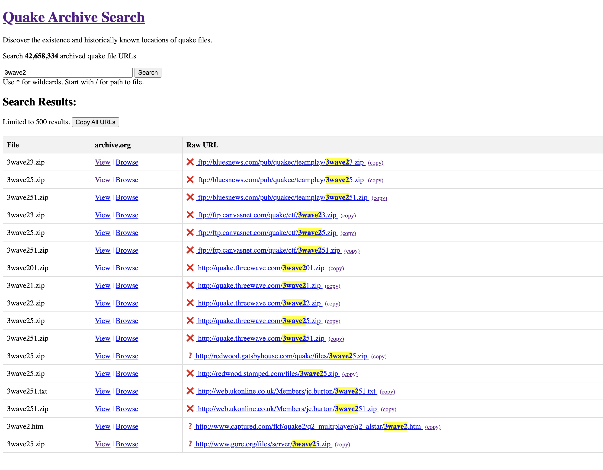

# Quake Archive Search

This project provides a searchable index of all known Quake file URLs.

* Discover the existence of quake releases (mods, maps, patches, etc.)
* Discover historical URLs where files were hosted and could be downloaded.

[See discussion circa Sep. 2024](https://discuss.quaddicted.com/t/find-rare-quake-files-new-archive-index-and-search).

[See more screenshots](pics/).

## Problem

The Quake community has produced a vast amount of content over the years, including mods, maps, texture packs, and other files. However, as time passes, many of these files become difficult to locate due to broken links, defunct websites, and scattered hosting locations. This situation makes it challenging for Quake enthusiasts to discover, access, and preserve this valuable content.

## Solution

The Quake Archive Search project addresses this issue by providing a comprehensive database and search tool for Quake 1 file URLs. Key features include:

- A centralized index of known Quake file URLs
- Powerful search capabilities, including wildcard support
- Integration with the Internet Archive's Wayback Machine for accessing archived versions of files
- Tools for creating and updating the file archive from various sources
- A user-friendly web interface built with Flask
- Python scripts for programmatic access to the database

This project aims to serve as a vital resource for the Quake community, enabling easier discovery and preservation of Quake-related content.

## Why Not Just Use the Wayback Machine?

While the Internet Archive's Wayback Machine is an invaluable resource for accessing archived web content, it has limitations when it comes to discovering and accessing Quake-related files across multiple websites:

1. **Limited Cross-Site Search**: The Wayback Machine only allows searching within one website at a time. Our Quake Archive Search enables users to **search across all archived websites simultaneously**, greatly expanding the scope of discoverable content.

2. **No Archive Crawling**: The Wayback Machine doesn't crawl the content of archived webpages. This means that files and URLs listed within archived pages remain hidden unless manually inspected. Our tool **actively crawls and indexes the content of archived webpages**, uncovering a wealth of previously inaccessible Quake file URLs.

3. **Quake-Specific Focus**: Unlike the general-purpose Wayback Machine, our tool is **tailored specifically for the archived Quake webpages**. It understands the context of Quake file types, hosting patterns, and community-specific resources.

4. **Aggregation and Standardization**: We collect URLs from various sources, standardize their format, and remove duplicates, providing a clean, unified database of Quake file locations.

By addressing these specific issues, the Quake Archive Search project complements the Wayback Machine, offering a more powerful and targeted solution for preserving and accessing the rich history of Quake content.

## Usage

### Create the database

1. Create the database schema by running `src/database_create.py`.

This will result in a database file `data/quake_website.db`.

### Add all archived URLs for known Quake websites

This will retrieve all URLs archived by the wayback machine for a specified list of Quake websites.

1. Create a list of all known quake websites in `data/quake_websites.txt`
2. Add all known websites to the database `src/quake_websites_add_all.py`
3. Retrieve all archived URLs for each added quake website `src/process_archived_list.py`

Repeat for more lists of known Quake websites.

For example, use `src/process_crawl_dir.py` to crawl local directories of Quake mods to locate more Quake websites. Store them in new lists and repeat steps 2 and 3 with these new lists.

For example:

* `data/quake_bot_research_websites.txt` all websites mentioned in the quake bot archive research directory.
* `data/quake_bot_research_websites2.txt` more permissive version of all websites mentioned in the quake bot archive research directory.
* `data/quake_bot_websites.txt` all websites mentioned in all .txt and all .zip files in the quake bot archive bin directory.
* `data/quake_official_websites.txt` all websites mentioned in all .txt and all .zip files in the quake official archive bin directory.

### Add crawled URLs for archived Quake websites

1. Define a list of Quake websites to download and crawl in `data/quake_websites_crawl.txt`
2. Run the crawl script in `src/process_archived_crawl.py`

This will download all text and HTML files archived for each website in the text file and crawl them for URLs to add to the index.

This is slow and may run for weeks.

Add websites as needed.

Increase the cutoff year for the archive retrieval as needed (e.g. from 2000 to 2010).

### Run web interface for search

1. Run `web/app.py` to run the Flask website interface.
2. Access the site via <http://127.0.0.1:5000/>

### Other

* Search the index manually with `src/database_search.py`
* Check on the number of archived websites and remaining websites to process with `src/database_status.py`
* Output all known quake file URLs (why?) with `src/file_urls_list_all.py`
* Output all processed quake websites (added via lists) with `src/process_list_all.py`
* Output all quake websites (added via lists) with `src/quake_websites_list.py`
* Report all quake file urls for wishlist files not in wishlist urls via `src/wishlist_url_checker.py`

## Database

The database (at the time of writing) is about 11 Gigabytes in size and is hosted privately (on my workstation).

I may share ot publicly in the future.

Until then, if you want me to search for a quake file for you, please email: Jason.Brownlee05@gmail.com

## TODO

* Add URLs discovered from a crawl of Quake CDs on archive.org (magazines, compilations, tools, etc.).
* Add URLs discovered from a crawl of Quake CD files (may require a download first).
* Add URLs discovered from a crawl of current Quake websites.
* Add URLs discovered from a crawl of quake USENET archives.
* Add URLs discovered from a crawl of quake mailing list archives.
* Add Makefile and make targets for main tasks for the project.
* Port the database to postgres/mysql/etc.
* Host website publicly somewhere.
